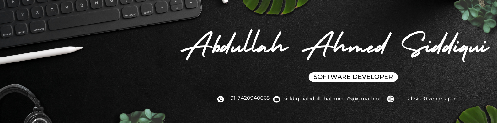

<div align="center">



# ✨ Abdullah Ahmed Siddiqui

### Software Developer &bull; Full-Stack & Backend Engineering &bull; QA & Automation

📍 Pune, Maharashtra - 411048  
📧 [siddiquiabdullahahmed75@gmail.com](mailto:siddiquiabdullahahmed75@gmail.com) &bull; 📱 [+91-7420940665](tel:+917420940665)  
🌐 [absid10.vercel.app](https://absid10.vercel.app) &bull; 💼 [linkedin.com/in/absid10](https://linkedin.com/in/absid10) &bull; 🐙 [github.com/absid10](https://github.com/absid10)

[](https://absid10.vercel.app)
[](https://www.linkedin.com/in/absid10/)
[](https://github.com/absid10)

</div>

---

## 📌 Summary

Software developer with hands-on experience across full-stack development, backend engineering, and software QA through internships and client projects. Proficient in Python, JavaScript/TypeScript, React, Node.js, SQL, REST APIs, and software testing, with experience building, testing, and deploying web applications.

---

## 💼 Experience

### **Software Developer Intern** — [Quartoloom Solutions](https://absid10.vercel.app)
*On-site, Pune &bull; Aug 2026 – Present*
- Currently training on QA processes, automation testing with Katalon Studio, and SQL as part of the onboarding process before being assigned to a project team.

### **Web Developer Intern** — [Amdox Technologies](https://absid10.vercel.app)
*Remote &bull; Apr 2026 – Jul 2026*
- Contributed to an AI-powered cloud ERP suite by building React UI components, integrating backend APIs, and performing functional and regression testing.
- Created test cases, documented defects, and supported frontend, backend, and QA activities across the software development lifecycle.

### **Founder & Full-Stack Developer** — [AyeBeesTech](https://www.linkedin.com/company/ayebeestech)
*Self-employed, Remote &bull; Jan 2026 – Aug 2026*
- Founded a software studio delivering full-stack web applications for small businesses, handling requirements, development, and deployment end-to-end.
- Built and shipped a full-stack ERP web application for a client while independently managing the development lifecycle.

---

## 🚀 Featured Projects

### 🏥 [Multi-Building Pathfinder](https://github.com/absid10/multi-building-pathfinder) &bull; [Live Demo ↗](https://multi-building-pathfinder.vercel.app)
- Built for Government Medical College and Hospital, Chh. Sambhajinagar, mapping OPD and Casualty buildings using Leaflet and SVG overlays.
- Implemented A* shortest-path routing with cross-floor connectors and QR-based building navigation, and designed REST APIs, JWT authentication, and background jobs using Flask, SQLAlchemy, Redis, and RQ.

### 👤 [FaceID Attendance System](https://github.com/absid10/FaceID-Attendance-App)
- Developed a Python desktop attendance system using Tkinter, OpenCV Haar Cascade detection, LBPH recognition, SQLite, and CSV reporting.
- Packaged the application as a standalone Windows executable and automated releases using GitHub Actions CI/CD.

### 🔒 [Secure Notes (FastAPI + React)](https://github.com/absid10/secure-notes)
- Built a secure REST API with FastAPI, JWT authentication, bcrypt password hashing, RBAC, and Pydantic validation.
- Implemented CRUD operations, ownership checks, Swagger documentation, and automated API tests using pytest and httpx.

---

## 🛠️ Technical Skills

| Domain | Technologies & Frameworks |
| :--- | :--- |
| **Languages** | Python, JavaScript/TypeScript, SQL, Java |
| **Frontend** | React, Vite, HTML5, CSS3, Tailwind CSS, Leaflet.js |
| **Backend** | Flask, FastAPI, Node.js, Express, SQLAlchemy, REST APIs, JWT |
| **Databases** | MySQL, PostgreSQL, SQLite, MongoDB |
| **Cloud & DevOps** | AWS (EC2, S3), Docker, Linux, Vercel, Render, Git, GitHub Actions |
| **Testing & QA** | Katalon Studio, Automation Testing, pytest, Postman, Functional/Regression Testing, Bug Reporting |
| **AI-Assisted Dev** | GitHub Copilot, Cursor, Claude Code, ChatGPT, Gemini, Google Antigravity |
| **Core Concepts** | Data Structures & Algorithms, OOP, DBMS, SDLC, CI/CD, AuthN/AuthZ, RBAC, Data Modeling, Debugging |

---

## 🎓 Education & Certifications

### **Education**
- **Government College of Engineering (GECA), Chh. Sambhajinagar**  
  *B.Tech in Computer Science & Engineering* &bull; Passed: June 2026 &bull; **CGPA: 6.601**

### **Certifications**
- **micro1 AI Interview Certified**: Passed AI-conducted technical interview; certified by micro1 (*April 2026*)
- **NPTEL**: Enhancing Soft Skills and Personality
- **NPTEL**: Entrepreneurship Essentials

### **Languages**
- English (Fluent) &bull; Hindi (Native) &bull; Urdu (Native) &bull; Marathi (Conversational)

---

## 💻 Portfolio Repository Architecture

| Category | Technology |
| :--- | :--- |
| **Structure** | `HTML5` — Semantic markup |
| **Styling** | `CSS3` `Bootstrap 5` — Custom dark theme with glassmorphism |
| **Animations** | `GSAP` `ScrollTrigger` — Smooth scroll-based animations & parallax |
| **Interactivity** | `jQuery` `Vanilla JavaScript` — Custom magnetic cursor, modals, side-nav |
| **Deployment** | `Vercel` — Automated CI/CD from `main` branch |

### Run Locally
```bash
# Clone the repository
git clone https://github.com/absid10/portfolio.git
cd portfolio

# Open in browser (no build step required!)
npx serve .
```

---

## 📬 Contact & Connect

- 📧 **Email**: [siddiquiabdullahahmed75@gmail.com](mailto:siddiquiabdullahahmed75@gmail.com)
- 💼 **LinkedIn**: [linkedin.com/in/absid10](https://www.linkedin.com/in/absid10/)
- 🐙 **GitHub**: [github.com/absid10](https://github.com/absid10)
- 🌐 **Portfolio**: [absid10.vercel.app](https://absid10.vercel.app)
- 📄 **Resume**: [Download CV (PDF)](https://drive.google.com/file/d/1-O7s7Wk81TYTWUoMmTNA2dQlYqtRxGAj/view?usp=sharing)

---

## 📄 License & Attribution

© 2026 **Abdullah Ahmed Siddiqui**. All rights reserved.  
Licensed under the [MIT License](LICENSE).

> **📌 Attribution Requirement**: If you use, clone, or adapt this portfolio codebase or design, you **must include explicit credit and attribution to Abdullah Ahmed Siddiqui** ([@absid10](https://github.com/absid10/portfolio)) in your repository and documentation.
